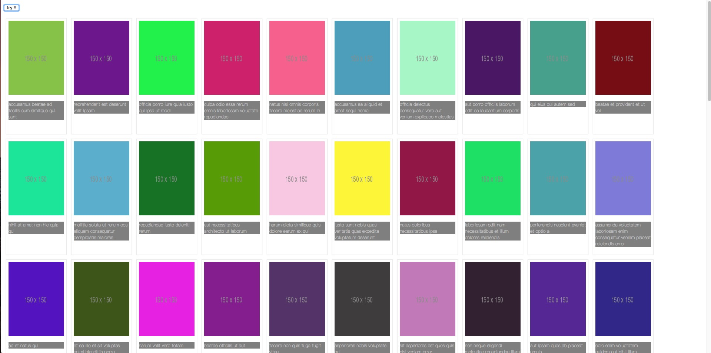

# ajaxwithJSONPlaceholder-
========================
>npm install -g json-server 下载
# 配置
## Resources

| [/posts](http://jsonplaceholder.typicode.com/posts) | 100 items |
|---|---|
| [/comments](http://jsonplaceholder.typicode.com/comments) | 500 items |
| [/albums](http://jsonplaceholder.typicode.com/albums) | 100 items |
| [/photos](http://jsonplaceholder.typicode.com/photos) | 5000 items |
| [/todos](http://jsonplaceholder.typicode.com/todos) | 200 items |
| [/users](http://jsonplaceholder.typicode.com/users) | 10 items |

## Routes

| GET | [/posts](http://jsonplaceholder.typicode.com/posts) |
|---|---|
| GET | [/posts/1](http://jsonplaceholder.typicode.com/posts/1) |
| GET | [/posts/1/comments](http://jsonplaceholder.typicode.com/posts/1/comments) |
| GET | [/comments?postId=1](http://jsonplaceholder.typicode.com/comments?postId=1) |
| GET | [/posts?userId=1](http://jsonplaceholder.typicode.com/posts?userId=1) |
| POST | /posts |
| PUT | /posts/1 |
| PATCH | /posts/1 |
| DELETE | /posts/1 |

## Example

Create a `db.json` file（文件有bd.json）

```source-json
{
  "posts": [
    { "id": 1, "title": "json-server", "author": "typicode" }
  ],
  "comments": [
    { "id": 1, "body": "some comment", "postId": 1 }
  ],
  "profile": { "name": "typicode" }
}
```

Start JSON Server

```source-shell
$ json-server --watch db.json
```

Now if you go to [http://localhost:3000/posts/1](http://localhost:3000/posts/1), you'll get

```source-json
{ "id": 1, "title": "json-server", "author": "typicode" }
```
# 实战（插入图片）
```
<script>
    var root = 'http://jsonplaceholder.typicode.com';

    $('#kk').click(function () {
        $.ajax({
            url: root + '/photos?albumId=1',
            method: 'GET'
        }).then(function (data) {
            var str = data;
            $.each(str, function (index, value) {
                var $outimg=$('<div>').addClass('img-out').appendTo(document.body);
                var $inimg = $('<div></div>').addClass('img-in');
                $inimg.appendTo($outimg);
                var $oimg = $('').addClass('imgo');
                $oimg.appendTo($inimg);
                var $op = $('<p></p>').addClass('title');
                $op.appendTo($inimg);


                $oimg.attr('src',str[index].thumbnailUrl);
                $op.text(str[index].title);
            })
        });
    })
</script>
```

#### 点击显示图片


